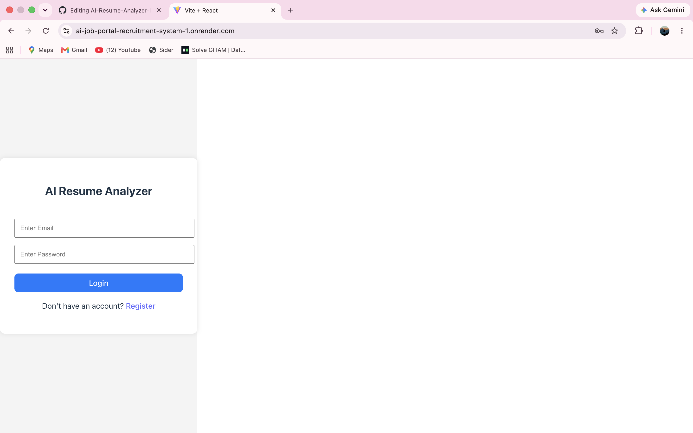
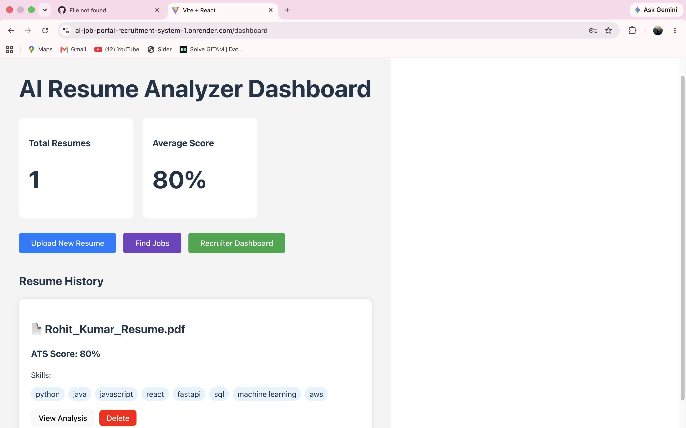
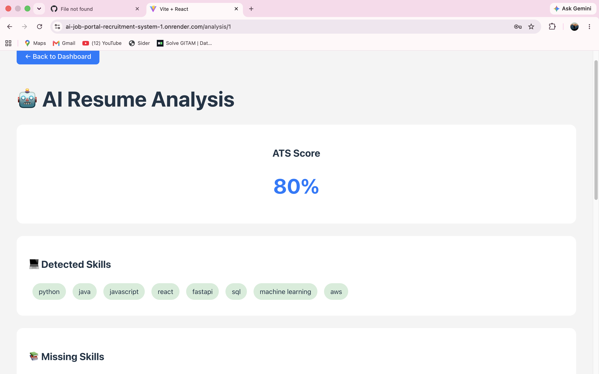
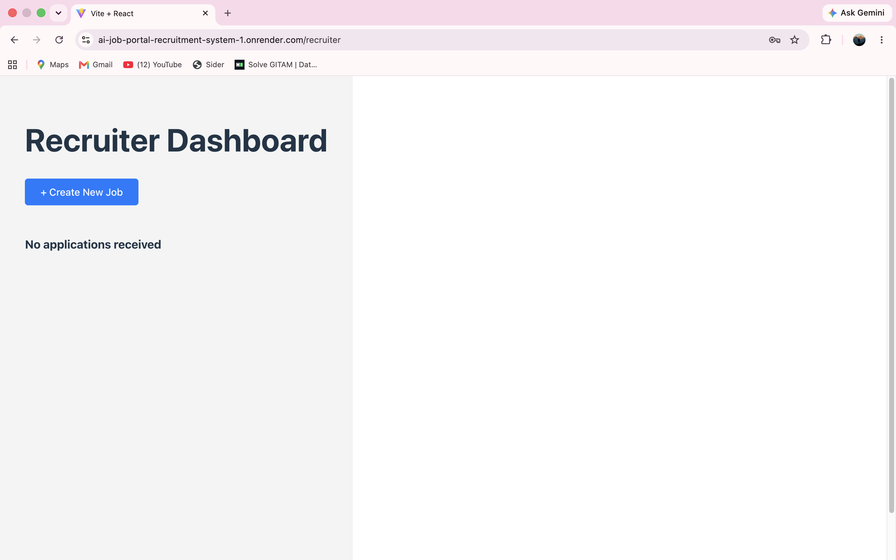

# **AI Resume Analyzer & Role-Based Job Recruitment Platform**

## **Overview**

A full-stack recruitment platform that simplifies the hiring process through AI-powered resume analysis and role-based access for Candidates and Recruiters. The platform enables candidates to upload resumes, receive ATS scores, and apply for jobs, while recruiters can create job postings, review applications, and manage the recruitment process efficiently.

## **Live Demo**
 **Application:** https://ai-job-portal-recruitment-system-1.onrender.com
---

## Features

### Candidate Features

- User registration and login with JWT authentication

- Upload resume (PDF)

- AI-based resume analysis

- ATS score calculation

- Job search and application

### Recruiter Features

- Recruiter dashboard

- Create and manage job postings

- View candidate applications

- Update application status

---
## Screenshots

### Login Page


### Candidate Dashboard


### ATS Score


### Recruiter Dashboard


## 📂 Project Structure

```text
AI_Resume_Analyzer/
│
├── .github/
│   └── workflows/
│       └── ci.yml
│
├── backend/
│   ├── routes/
│   │   ├── auth.py
│   │   ├── resume.py
│   │   ├── analysis.py
│   │   ├── users.py
│   │   ├── jobs.py
│   │   └── applications.py
│   │
│   ├── utils/
│   │   ├── gemini_ai.py
│   │   ├── email_service.py
│   │   ├── pdf_reader.py
│   │   ├── job_matcher.py
│   │   ├── auth_utils.py
│   │   ├── helper.py
│   │   └── skill_extractor.py
│   │
│   ├── main.py
│   ├── models.py
│   ├── schemas.py
│   ├── database.py
│   ├── ai_analysis.py
│   ├── resume_parser.py
│   ├── ats_score.py
│   ├── requirements.txt
│   └── Dockerfile
│
├── frontend/
│   ├── src/
│   │   ├── components/
│   │   │   └── ProtectedRoute.jsx
│   │   │
│   │   ├── pages/
│   │   │   ├── login.jsx
│   │   │   ├── register.jsx
│   │   │   ├── VerifyOtp.jsx
│   │   │   ├── dashboard.jsx
│   │   │   ├── UploadResume.jsx
│   │   │   ├── Analysis.jsx
│   │   │   ├── jobs.jsx
│   │   │   ├── CreateJob.jsx
│   │   │   ├── RecruiterDashboard.jsx
│   │   │   ├── RecruiterViewResume.jsx
│   │   │   └── jobmatch.jsx
│   │   │
│   │   ├── services/
│   │   │   └── api.js
│   │   │
│   │   ├── App.jsx
│   │   ├── App.css
│   │   ├── index.css
│   │   └── main.jsx
│   │
│   ├── Dockerfile
│   ├── package.json
│   ├── package-lock.json
│   └── vite.config.js
│
├── docker-compose.yml
│
├── .gitignore
│
└── README.md
```

## **Technology Stack**

### **Frontend**

- React.js
- React Router
- Axios
- HTML5
- CSS3

### **Backend**

- FastAPI
- Python
- SQLAlchemy
- SQLite
- JWT Authentication

### **AI Integration**

- Google Gemini AI
- Resume Parsing
- ATS Scoring

### **DevOps**

- Docker
- Docker Compose
- GitHub Actions (CI)
- Render Continuous Deployment (CD)

---

## **Docker**

The application is fully containerized using Docker with separate Docker images for the frontend and backend. Docker Compose is used to orchestrate both services, enabling a consistent development environment and simplified deployment.

---

## **CI/CD Pipeline**

A GitHub Actions workflow automates the Continuous Integration process by installing dependencies, validating the React application build, and building Docker images for both frontend and backend. After successful validation, Render automatically deploys the latest version from the **main** branch, providing a complete Continuous Deployment pipeline.

---
##  Deployment

The application is deployed using Render with separate frontend and backend services.

### Backend Deployment
- FastAPI backend deployed on Render
- Connected with SQLite database
- Environment variables configured securely

### Frontend Deployment
- React frontend deployed on Render
- Configured with backend API URL
- Automatic deployment triggered from the main branch

### Live Application

Application:
https://ai-job-portal-recruitment-system-1.onrender.com

## **Authentication & Security**

- JWT-based Authentication
- Role-Based Access Control (RBAC)
- Protected Routes
- Email OTP Verification

---

## **Project Architecture**

- Candidate Portal
- Recruiter Portal
- React Frontend
- FastAPI REST API
- SQLite Database
- Google Gemini AI Integration
- Brevo Email Service

---

## **Future Enhancements**

- Interview Scheduling
- Resume Recommendation Engine
- Real-time Notifications
- Recruiter Analytics Dashboard
- Cloud Database Integration

## How to Run the Project

### Backend Setup

1. Navigate to the backend folder:

```bash
cd backend
2. Create and activate virtual environment:
python -m venv venv
Activate virtual environment:
Mac/Linux:
source venv/bin/activate
Windows:
venv\Scripts\activate
3. Install backend dependencies:
pip install -r requirements.txt
4. Start the FastAPI server:
uvicorn main:app --reload
Backend will run at:
http://127.0.0.1:8000

Frontend Setup

1. Open a new terminal and navigate to the frontend folder:
cd frontend
2. Install frontend dependencies:
npm install
3. Start the React application:
npm run dev
Frontend will run at:
http://localhost:5174
Application Flow

1. User creates an account through registration.
2. Email OTP verification is completed.
3. User logs in securely.
4. Candidates can upload resumes and get AI-based resume analysis.
5. Recruiters can create job postings and manage applications.
6. AI features help with resume evaluation and candidate-job matching.
